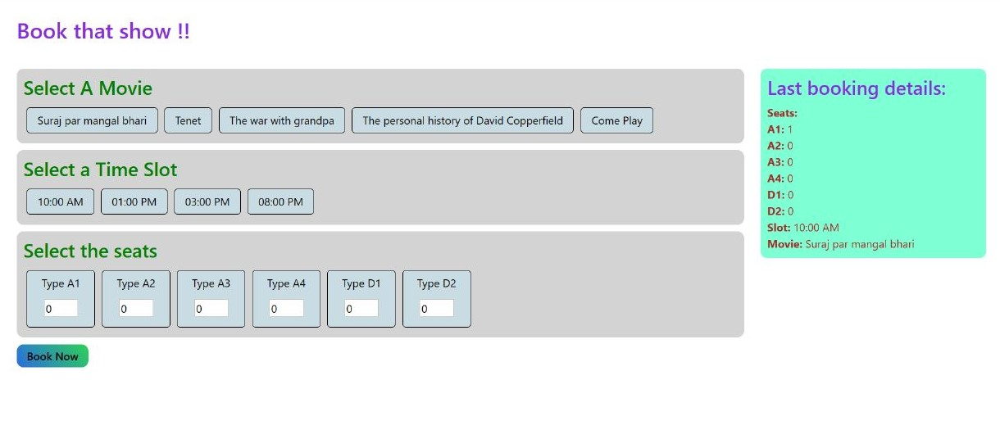

<h2>Book My Show</h2>

This is a backend capstone project Almabetter, 
    it is use for a Movie ticket booking app. 
    this app helps of the book that show, To use this app, 
    first you have to click on select movie, 
    after that you have to click on select a time slot,
    and finally you have to click on select a seat,and click on book now button, 
    after that your tickets will be booked. All api's are working properly with proper error logging, 
    This project is fully responsive.

  <h2>Demo</h2>
  
   
  <h2>Deployed link</h2>
  
  
  <h2>API Documentation Link</h2>
  

<h2>Features</h2>
It has been made with the help of backend and frontend.

● React.JS- frontend development

● CSS- styling

● Media Query- responsiveness

● React Skeleton- displaying loading state

● Express js- server side services

● MongoDB- database

<h2>Frontend Installation</h2>
  
cd Client

  
Npm Install

  
npm start 

  
frontend part will be run

<h2>Backend Installation</h2>
 
Cd server

 
Npm Install

 
npm start nodemon

 
Backend part will be run

 <h2>Screenshort</h2>

We can book tickets on this section

<h2>Book Movie</h2>

This Section is Book Movie we can select any movie name

<h2>Book Time slot</h2>

This Section is Book Time slot we can select your available time

<h2>Book seat</h2>

This Section is book seat we can select any seats and then we can click the book now button
    at this movement tickets booking successful

<h2>Booked Tickets</h2>

As soon as our tickets are booked, we will see my show on the right side, 
   what is the name and time of the movie and the seats number will be shown.

